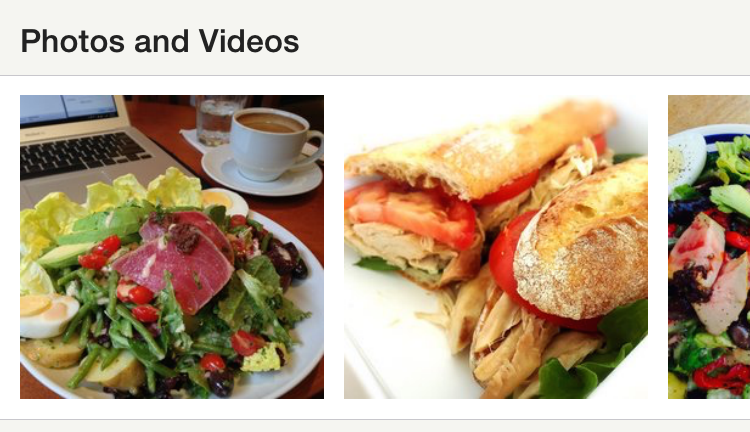

# YLTableView

YLTableView is a framework for working with UITableView used by a number of the table views inside of the Yelp app. It makes it easy to work with cell models, allows your cells to have child view controllers, and provides a framework for building your own pull-to-refresh header.


## Installation

We recommend using CocoaPods to install YLTableView. To do so, add the following to your `Podfile`:

```
pod 'YLTableView', '~> 1.0'
``` 

# Example usage
You can clone the project and check out the example app to see YLTableView in use.

## Cells and Models

All cells should take a model. Cells generally expect one specific type of model, while a given model could work with any number of cells. Start by creating a new `YLTableViewCell` subclass, and implementing `setModel:`:

```
@interface YLExampleTextCell : YLTableViewCell
@end

@implementation YLExampleTextCell
- (void)setModel:(NSObject *)model {
  NSAssert([model isKindOfClass:[NSString class]], @"Must use %@ with %@", NSStringFromClass([NSString class]), NSStringFromClass([self class]));
  self.mainTextLabel.text = (NSString *)model;
}
@end
```

This cell expects an NSString as its model, but your cell can use any object you want. 

## Data Source
To use YLTableView, you should subclass `YLTableViewDataSource`. After implementing a few simple methods, `YLTableViewDataSource` takes care of connecting cells to models.

```
@interface YLExampleTableViewDataSource : YLTableViewDataSource
@property (copy, nonatomic) NSArray *models;
@end

@implementation YLExampleTableViewDataSource
- (instancetype)init {
  if (self = [super init]) {
    _models = @[@"cell one", @"cell two", @"cell three"];
  }
  return self;
}

#pragma mark YLTableViewDataSource subclass

- (NSString *)tableView:(UITableView *)tableView reuseIdentifierForCellAtIndexPath:(NSIndexPath *)indexPath {
  return NSStringFromClass([YLExampleTextCell class]);
}

- (NSObject *)tableView:(UITableView *)tableView modelForCellAtIndexPath:(NSIndexPath *)indexPath {
  // The model returned here must work with the cell specified above.
  return self.sectionModels[indexPath.row];
}

#pragma mark UITableViewDataSource

- (NSInteger)tableView:(UITableView *)tableView numberOfRowsInSection:(NSInteger)section {
  return self.sectionModels.count;
}
@end

```

## Table View
Finally, you can use a YLTableView to connect everything together.

```
@interface YLExampleViewController : UIViewController
@end

@implementation YLExampleViewController
- (void)loadView {
  [super loadView];
  YLExampleTableViewDataSource *dataSource = [[YLExampleTableViewDataSource alloc] init];
  
  YLTableView *tableView = [[YLTableView alloc] initWithFrame:CGRectZero style:UITableViewStyleGrouped];
  // YLTableViewDataSource has to be the delegate and the dataSource of the table view.
  tableView.dataSource = dataSource;
  tableView.delegate = dataSource;
  
  // Registering cells and reuse identifiers
  [tableView registerClass:[YLExampleTextCell class] forCellReuseIdentifier:NSStringFromClass([YLExampleTextCell class])];
  
  self.view = tableView;
}
@end
```

# Child View Controllers

In order to make your cells more modular, `YLTableViewDataSource` allows your cells to have child view controllers. Simply have your cell implement the `YLTableViewChildViewControllerCell` protocol and set the `parentViewController` property on your data source. `YLTableViewDataSource` will take care of the rest.

This is great when your cells have multiple buttons or actions that can push on view controllers. For example, the cell below is a UICollectionView owned by a UIViewController, which pushes on larger image views when the user taps on an image.



Check out [YLExampleImagesCell.m](YLTableViewExample/ImagesView/YLExampleImagesCell.m) for an example.

# Pull to Refresh

YLTableView doesn't include a pull-to-refresh header, but makes it really easy to build your own. Simple subclass `YLRefreshHeaderView` and implement `setRefreshState:animated:`. Then you can set the `refreshHeader` property on `YLTableView` and add a listener for the `UIControlEventValueChanged` event on your refresh header.

Check out [YLExampleRefreshHeader.m](YLTableViewExample/YLExampleRefreshHeader.m) for an example.

## License

Copyright 2015 Yelp, Inc.

Licensed under the Apache License, Version 2.0 (the "License"); you may not use this file except in compliance with the License. You may obtain a copy of the License at http://www.apache.org/licenses/LICENSE-2.0

Unless required by applicable law or agreed to in writing, software distributed under the License is distributed on an "AS IS" BASIS, WITHOUT WARRANTIES OR CONDITIONS OF ANY KIND, either express or implied. [See the License](LICENSE.txt) for the specific language governing permissions and limitations under the License.
